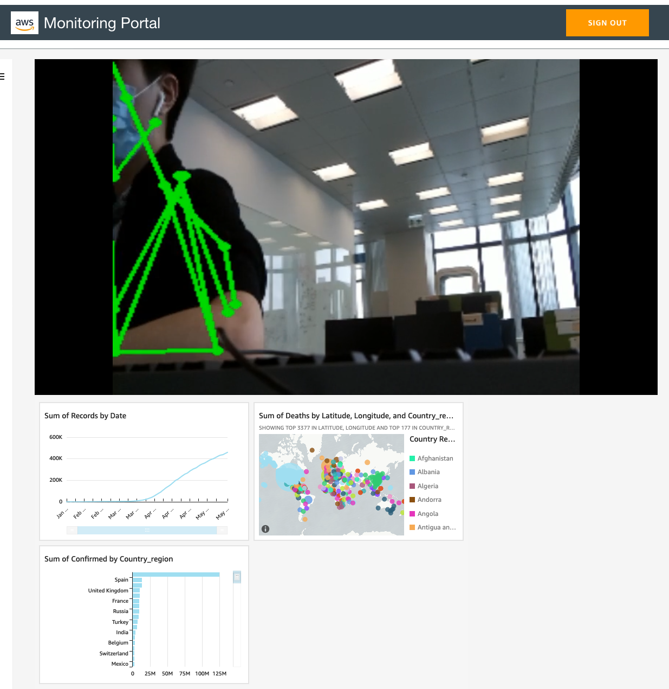

# Edge Computer Vision data lake with Greengrass V2

## Contents and structure of the repo
This repository serves as a reference implementation of video analytics at edge and building a data lake on top of the data gathered from CV models running at edge. Originally we were building a demo to a manufacturing customer for use case that determines whether their workers follow standard operating procedures. This repo contains the source code to deploy the edge CV solution, which is an ML model detecting human pose, based on TFLite.

The repository contains two sub-repositories: 
```sh
./edge-device               | templates and scripts to deploy a Gateway and all components to allow CV/ML at the edge
./cloud                     | templates and code to deploy the cloud resources on AWS
./docs                      | auxiliary files for the documentation
```
#### High level architecture


Inference happens on the edge gateway running Greengrass V2. Results are then synced back to cloud (in the form of video streams, images and messages) where different visualization tools are employed to present the results

## Table of contents

* [ Prerequirements ](#prereqs)
* [ Setup ](#started)
* [ Installation ](#install)
* [ Usage ](#usage)
* [ License ](#license)
* [ Contact ](#contact)

<a name="prereqs"></a>
## Prerequirements

* An AWS account
* Administrator permissions in your AWS account
* [AWS CLI](https://docs.aws.amazon.com/cli/latest/userguide/cli-chap-install.html)
* [AWS CDK](https://docs.aws.amazon.com/cdk/latest/guide/getting_started.html)
* Edge device with camera (Raspberry Pi running 32-bit Raspbian OS / Jetson Nano with JetPack 4.5.1 in this example)

<a name="started"></a>
## Setup

> This solution was only tested in ap-northeast-1 region.

* Set up edge device following the [instructions](https://docs.aws.amazon.com/greengrass/v2/developerguide/setting-up.html)
* Verify that you can see the device in the Greengrass console
* Create 2 S3 buckets, 1 for storing Greengrass artifacts for deployment purposes, the other one is for storing images uploaded from Greengrass Streams Manager, note the bucket names as you will use them later
* Make sure the role alias your Greengrass device assumes has access to the above 2 buckets, example is shown in the `edge-device/scripts/greengrass-setup/device-role-access-policy.json` file
* On your device, make sure you have installed Python 3.6+ and [OpenCV compiled with GStreamer support](https://discuss.bluerobotics.com/t/opencv-python-with-gstreamer-backend/8842)
* Install [DLR](https://neo-ai-dlr.readthedocs.io/en/latest/install.html)
* Install the [Kinesis Video Streams Producer SDK](https://github.com/awslabs/amazon-kinesis-video-streams-producer-sdk-cpp) compiled with GStreamer plugins, add the required environment variables
* In [Kinesis Video Streams Console](https://ap-northeast-1.console.aws.amazon.com/kinesisvideo/home?region=ap-northeast-1#/dashboard), create a new video stream that matches your thing name
* Set up a Sagemaker notebook instance (Or Studio notebook)
* Run through the notebook in `cloud/sagemaker/neo-tflite-pose.ipynb`, replace the S3 bucket as needed, note the model version as you will need that for deploying the model on Greengrass
* After the model is stored on S3, note its location and replace values as needed in `edge-device/scripts/greengrass-deployment/pose-estimator-model/deploy-pose-estimator-model.sh` and `edge-device/components/recipes/com.model.tflite.pose/com.model.tflite.pose.yaml` The `chmod command` should grant to user you wish to run the ML component with.
* The files in `edge-device/deployment/previous-deployment` tells Greengrass how to deploy your components, make sure you change the `runWith` user to the one you used when installing the prerequisite libraries.
* Run `edge-device/scripts/greengrass-deployment/pose-estimator-model/deploy-pose-estimator-model.sh`, the component containing your pose model is deployed
* The code containing the inference logic is at `edge-device/components/src/aws.edgecv.datalake.demo.poseEstimator`, for both Jetson Nano and Raspberry Pi respectively
* The file `edge-device/components/recipes/aws.edgecv.datalake.demo.poseEstimator/aws.edgecv.datalake.demo.poseEstimator.yaml` will set some environment variables on your edge devices, change the values to fit your environment
* Inspect `edge-device/scripts/greengrass-deployment/pose-estimator/deploy-pose-estimator.sh`, change values as needed, and run it, the component containing your inference code is deployed.
* In `cloud/infrastructure/bin/infrastructure.ts`, replace your account id
* In `cloud/infrastructure/src/portal/src/components/HLSPlayer.js`, replace the stream name with your KVS stream name
* Deploy the CDK stack:
```
cdk bootstrap
./build.sh
```
* Up till now you have provisioned the infrastructure, but we need to gather more data before a dashboard can be generated.

<!-- USAGE EXAMPLES -->
<a name="usage"></a>
## Usage

### Greengrass

There are 2 Greengrass components in this example, one deploys the pose detection model compiled with Sagemaker Neo, and the other one running the inference logic. Here is the high-lvl logic of the component:
```
1. Capture video frame from camera (Can use OpenCV or GStreamer API)
2. Preprocess the image to fit into the pose model
3. Run inference with DLR (using the Neo-compiled model)
4. Overlay the frame with pose keypoints
5. Write the frame into an output video stream which will be sent to KVS
6. Generates some dummy data to act as CV output which is then sent to IoT Core
7. Send the image frame to S3 via Streams Manager, the image is used for model retraining
```

### ETL & Datalake

As data is sent to the IoT Core, messages are streamed into Kiensis Firehose and persist at S3. An hourly ETL job will transform the data into Parquet at another bucket for Athena queries. A nightly ETL job will do almost the ETL but load into a Redshift cluster. You can comment out the Redshift part if you don't need Redshift. You can trigger the jobs manually if you want results right away. Feel free to explore the data using Athena/Redshift, you should see the processed data in the Glue data catalog.

### Quicksight Dashboard
With the cleaned data in place we can create dashboard with Quicksight

> Make sure you switch to the right region after entering Quicksight console

#### Visualizing Athena data
1. Go to `Manage Quicksight` in Quicksight console, click `Security % Permissions`, `Add or Remove` uncheck Athena and check it again, select the right table and bucket containing the ETL processed data.
2. Create dataset using Athena as source
3. Create Analysis and add your visuals
4. Publish it as a dashboard, note its dashboard Id and name (can be found by looking at your browser URL)

#### Visualizing Redshift data
1. Go to `Manage Quicksight` in Quicksight console, click `Security % Permissions`, `Add or Remove` check Redshift.
2. Find the leader node private IP of your Redshift cluster in Redshift console
3. Add a VPC connection to the VPC containing your Redshift cluster, use the same security group as the Redshift cluster itself
4. Create dataset using Redshift as source, use the private IP of the Redshift node you copied earlier
5. Create Analysis and add your visuals
6. Publish it as a dashboard, note its dashboard Id and name (can be found by looking at your browser URL)

### Web Portal
A web portal that simply plays the KVS streams at the top while showing the embedded Quicksight dashboard. It consists of a React frontend and an API that retrieves embed URL from Quicksight

To set up the embedded Quicksight Dashboard:

1. In `cloud/infrastructure/lib/portal-backend.ts`, replace the environment variables with the dashboard Id and name you onted earlier
2. In Quicksight Console, select `Manage Quicksight` and `Domains and Embedding`, add both the API Gateway URL up to `.com` (found in CloudFormation output) and the Web portal URL (Also found in CloudFormation output)
3. Open the portal, you should see the video streams and the embedded dashboard

> If you don't see the video, that means your Greengrass component is not sending video to KVS right now

Result is something like this:



<!-- LICENSE -->
<a name="license"></a>
## License

Distributed under the MIT License.
